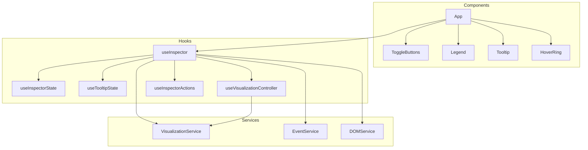

# Tailwind Inspector 仕様書

## 概要
Tailwind CSS の余白や色などのスタイルをブラウザ上で視覚的に確認するための Chrome 拡張（Manifest V3）。React + TypeScript + Vite で実装され、コンテンツスクリプトとしてページに React UI を差し込みます。

## 想定ユースケース
- Tailwind CSS を使った画面の余白（padding/margin/gap）や文字色/背景色/フォント情報を素早く確認したい
- マウスホバー中の要素の情報を軽量に確認したい（Hover モード）
- 将来的にページ内の全要素の可視化（All モード）を有効化したい

## 技術スタック / ビルド
- React 18 / TypeScript 5 / Vite 5
- Chrome Extension Manifest V3
- ビルド: `npm run build`（`dist/` に `content.js` 等を出力）
- デバッグ: `npm run dev`（Vite dev サーバ）

Chrome への読み込み
1. `npm run build`
2. Chrome で「拡張機能 > デベロッパーモード > パッケージ化されていない拡張機能を読み込む」
3. リポジトリルート（`manifest.json` があるディレクトリ）を選択

## 使用方法
1. Chrome 拡張機能としてインストール
2. 右下のボタンで Inspector を ON/OFF
3. Mode ボタンで Hover/All を切り替え
4. Legend ボタンで説明表示の有無を切り替え

## 配置・エントリ
- `manifest.json`
  - `content_scripts`: `dist/content.js` と `dist/content.css` を全 URL に注入
  - 権限: `activeTab`, `scripting`, `storage`
  - `background.service_worker`: `dist/background.js`（拡張インストール時の初期化やメッセージ処理を担当）

- `src/content.tsx`
  - `document.documentElement` 直下に `
` を生成し、React ルートをマウント
  - ルートコンポーネント `App` を描画

## UI 構成
- `App.tsx`
  - `useInspector` フックから状態とハンドラを取得
  - 構成:
    - グローバルレイヤ（`
`）
    - レジェンド（`Legend`）
    - ホバーリング（`HoverRing`）
    - ツールチップ（`Tooltip`）
    - 右下トグルボタン群（`ToggleButtons`）
  - `enabled` が false の場合は UI を描画しない

- `components/ToggleButtons.tsx`
  - 3 つのボタンを表示：
    - Inspector: ON/OFF（拡張全体の有効/無効）
    - Mode: Hover/All（モード切替）
    - 説明: ON/OFF（レジェンドの表示切替）
  - `aria-pressed` を付与しアクセシビリティ配慮
  - 右下にヒントテキストを表示

- `components/Legend.tsx`
  - 余白や要素アウトラインの色凡例
  - CSS カスタムプロパティ（`--ti-padding`, `--ti-margin`, `--ti-gap`, `--ti-outline`）に従って表示

- `components/Tooltip.tsx`
  - マウス位置付近に、対象要素の情報を表示
  - 表示内容:
    - Tailwind クラス（フィルタ済み）
    - Text 色 / BG 色（16進変換表示）
    - Padding / Margin（上下左右 px）
    - Font Size / Line Height / Border Radius
- `components/HoverRing.tsx`
  - 対象要素の `padding`/`margin` を色付きセグメントで表示し、一定以上の厚みがあれば数値ラベルを付与

- `styles.css`
  - ツールチップ、レジェンド、右下ボタン群のスタイル
  - 最前面表示のため `z-index: 2147483647` を採用

## ロジック構成
### hooks
- `useInspector.ts`
  - `useInspectorRefactored` を再エクスポートし、UI から利用されるエントリポイント
- `useInspectorState.ts`
  - `enabled` / `inspectorMode` / `legendVisible` を localStorage と同期
- `useTooltipState.ts`
  - `tooltipData` や `mousePosition`、`hoverElement` を管理
- `useVisualizationController.ts`
  - `VisualizationService` を使い全要素モードの描画を制御
- `useInspectorActions.ts`
  - トグル操作を定義し、`createToast` で通知

### services
- `VisualizationService.ts`
  - padding/margin/gap/outline のオーバーレイ生成と全要素描画
- `EventService.ts`
  - `handleMouseMove` / `handleMouseOver` / `handleScroll` / `createDebouncedResize` でマウス座標や要素情報を取得し、`TooltipData` を算出・再描画をトリガー
- `DOMService.ts`
  - DOM イベントリスナーと `MutationObserver` のセットアップ

### `useInspectorRefactored.ts`
- 上記フックとサービスを統合し、イベント処理と状態更新を一元管理
- 依存性注入によりテストや拡張が容易

## ユーティリティ（`utils.ts`）
- `toSides(cs, prop)`：CSSStyleDeclaration から `Top/Right/Bottom/Left` を数値化
- `extractTailwindClasses(className)`：Tailwind らしきトークンのみ抽出
- `toHex(color)`：`rgb(a)` → `#RRGGBB(AA)` 変換
- `escapeHTML(s)`：安全な HTML エスケープ
- `groupBy(items, closeFn)`：距離近似を定義可能なグルーピング（将来の All モードで使用想定）
- `createSegmentWithLabel(...)`：色付きセグメントとpxラベルを生成
- `createToast(text)`：右下の簡易トースト表示
- `throttle(func, delay)` / `debounce(func, delay)`：イベント頻度制御
- 定数：`MIN_LABEL_THICKNESS`, `MAX_ELEMENTS`, `MAX_GAP_SEGMENTS`, `ROW_EPS`, `COL_EPS`（将来の可視化で使用）

## 型定義（`types.ts` 抜粋）
- `Sides { t, r, b, l }`
- `TooltipData { classes, fg, bg, pad, mar, fontSize, lineHeight, radius }`
- `Ring`, `SideLabel`（旧/将来のオーバーレイ用）

## 既存ファイルとの関係
- `old_content.js` / `old_overlay.css`
  - 旧実装（純 DOM/CSS）で、ホバーのリング描画や All モードの可視化ロジックが含まれる
  - 現在の React 実装では未統合だが、移植の参考資料
- `src/background.ts`
  - インストール時に `chrome.storage.sync` を初期化し、`GET_STORAGE`/`SET_STORAGE` メッセージやアイコンクリックを処理
  - 現在の UI は localStorage を直接参照しており、サービスワーカーとの連携は未完了

## 制限事項 / 既知の課題
- All モードの可視化（`buildGlobal()`）が未実装
- 背景サービスワーカーと UI 側の状態管理が分離しており（`chrome.storage.sync` と `localStorage`）、同期方法が未整備
- 極端に複雑な DOM でのパフォーマンスは未検証（将来の All モードでは `MAX_*` 定数で制御予定）

## セキュリティ / アクセシビリティ
- ツールチップ内のテキストは `escapeHTML` でエスケープ
- ボタンに `aria-pressed` を付与
- 画面最前面表示のため非常に高い `z-index` を使用

## 今後の拡張（提案）
1. All モードの実装
   - `old_content.js` のアルゴリズムを `VisualizationService` などに移植
   - 要素列挙の上限やグルーピング、Gap 帯の分割などを React 化
2. Background との連携強化
   - `chrome.storage.sync` と UI 側 `localStorage` の統一、不要であれば背景スクリプトの簡素化
3. 軽量化・最適化
   - スロットリング/デバウンス、アイドル時レイアウト計測の調整

## 依存関係ダイアグラム

